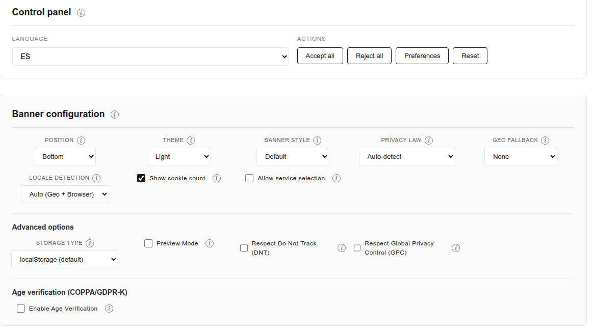
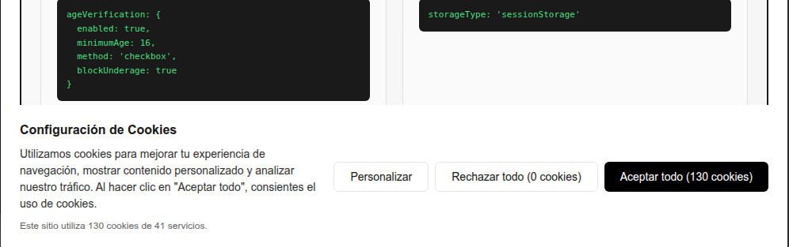
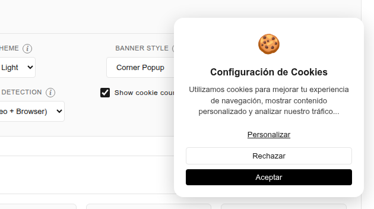
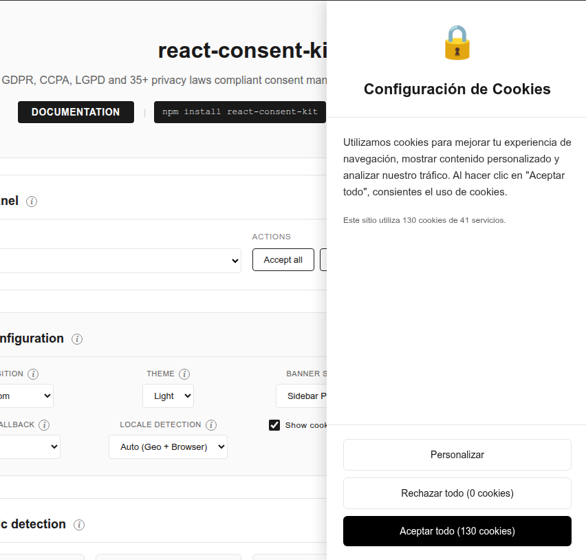
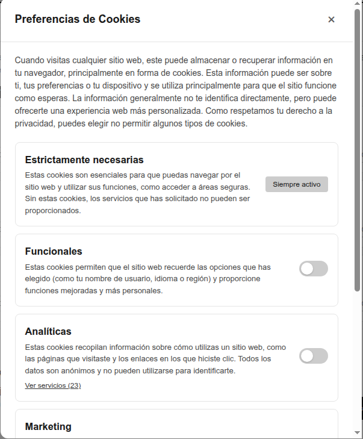
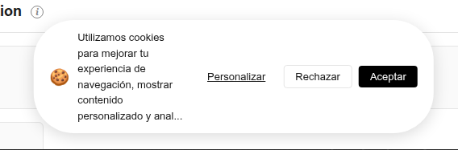
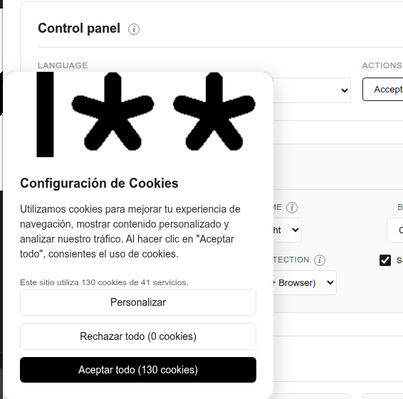
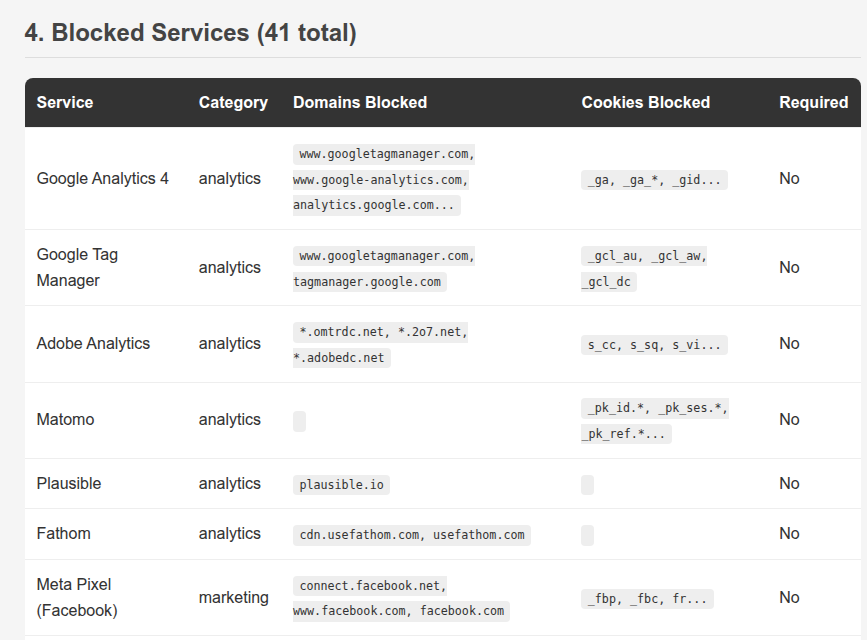
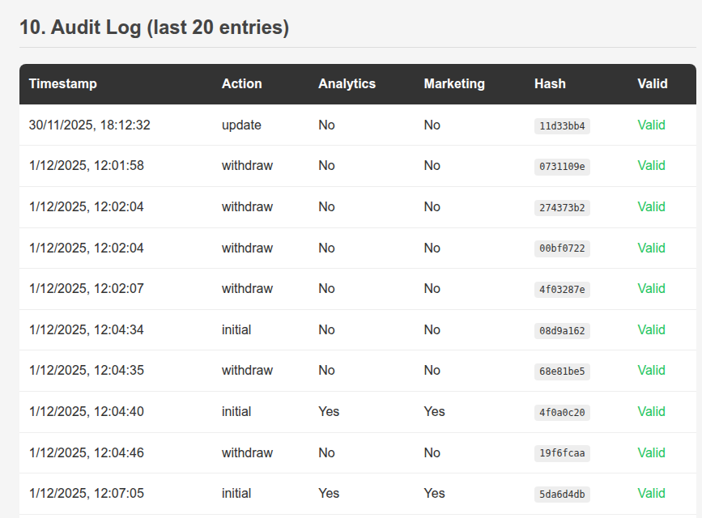

# react-consent-shield

A React library for cookie consent management that blocks tracking scripts until users give consent. Unlike banners that only show a popup, this library intercepts script loading at the DOM level, preventing analytics, marketing, and tracking scripts from executing before the user makes a choice.

Includes automatic geo-detection for 52 privacy laws worldwide (GDPR, CCPA, LGPD, POPIA, PDPA, and regional variations), 274 pre-configured service presets, and Google Consent Mode v2 integration.

[](https://www.npmjs.com/package/react-consent-shield)
[](./LICENSE)
[](./tests/COVERAGE.txt)
[](./tests/)

[](https://react.dev/)
[](https://react.dev/)
[](https://nextjs.org/)
[](https://nextjs.org/)
[](https://www.typescriptlang.org/)
[](https://nodejs.org/)

**Live demo:** [react-consent-shield.onrender.com](https://react-consent-shield.onrender.com)

**npm:** [npmjs.com/package/react-consent-shield](https://www.npmjs.com/package/react-consent-shield)

**GitHub:** [github.com/686f6c61/react-consent-shield](https://github.com/686f6c61/react-consent-shield)

---

## Features

The library provides everything needed to implement cookie consent in a React application. Each feature is designed to work independently or together with others, so you can start simple and add complexity as needed.

- **Real script blocking** - Actually blocks tracking scripts until consent is given
- **Geographic detection** - Automatically applies the correct privacy law based on user location
- **274 service presets** - Google Analytics, Meta Pixel, Hotjar, TikTok, regional services (Yandex, Baidu, Naver...), and many more
- **Google Consent Mode v2** - Full integration with automatic consent signal updates
- **Cookie scanner** - Detects undeclared cookies for compliance auditing
- **Audit logging** - Cryptographically verified consent records
- **Compliance reports** - Generate JSON/HTML reports for privacy audits
- **Consent versioning** - Auto-detect service changes and prompt re-consent
- **Subdomain sharing** - Share consent across subdomains automatically
- **10 languages** - English, Spanish, German, French, Portuguese, Italian, Dutch, Polish, Japanese, Chinese
- **WCAG 2.2 AA accessible** - Full keyboard navigation, screen reader support, focus trap, high contrast mode
- **8 banner variants** - Default, fullwidth, modal, floating, card, minimal, corner, sidebar
- **Age verification** - COPPA/GDPR-K compliance with checkbox, year, or birthdate verification
- **TypeScript** - Full type definitions included
- **Works everywhere** - Next.js, Vite, Create React App, plain HTML

---

## Use Cases

These examples show common scenarios where the library helps manage consent. Each example includes working code that you can copy and adapt to your project.

### E-commerce site with analytics

An online store typically needs conversion tracking for marketing campaigns, heat maps to understand user behavior, and compliance with multiple privacy laws depending on where customers are located. This configuration handles all three requirements by enabling geo-detection, which automatically determines whether to show opt-in (GDPR) or opt-out (CCPA) consent flows.

```tsx
<ConsentProvider
  config={{
    services: [googleAnalytics, metaPixel, hotjar],
    geoDetection: { enabled: true },
  }}
>
```

### SaaS application with multiple tracking services

A SaaS product often uses multiple analytics tools for different purposes: product analytics (Mixpanel, Amplitude), customer data platforms (Segment), and session recording for debugging (Clarity, FullStory). With `granularConsent: true`, users can choose exactly which services to enable, giving them more control while still allowing you to collect the data you need from users who opt in.

```tsx
<ConsentProvider
  config={{
    services: [
      mixpanel,
      amplitude,
      segment,
      microsoftClarity,
      fullstory,
    ],
    granularConsent: true,
  }}
>
```

### Multi-region compliance

When your application serves users from multiple countries, you need to handle different consent requirements. The library detects the user's location and applies the appropriate law automatically. The `fallbackLaw` option ensures that if geo-detection fails, the strictest rules apply by default, keeping you compliant even in edge cases.

```tsx
<ConsentProvider
  config={{
    services: [googleAnalytics],
    geoDetection: {
      enabled: true,
      fallbackLaw: 'GDPR', // Default to strictest
    },
  }}
>
```

### Age-gated content and child protection

If your site is aimed at or accessible to minors, regulations like COPPA (USA, under 13) and GDPR-K (EU, under 16) require parental consent or age verification before collecting any personal data. The library supports three verification methods: a simple checkbox declaration, year of birth selection, or full birthdate input. When a user doesn't meet the minimum age, tracking scripts remain blocked regardless of other consent choices.

```tsx
<ConsentProvider
  config={{
    services: [googleAnalytics, metaPixel],
    ageVerification: {
      enabled: true,
      method: 'birthdate', // 'checkbox' | 'year' | 'birthdate'
      minimumAge: 16, // GDPR-K requirement
      parentalConsentRequired: true,
    },
  }}
>
```

### Blog or content site with minimal tracking

Not every site needs complex analytics. For a personal blog or documentation site, you might only want basic page views without user profiling. Privacy-focused analytics like Plausible or Fathom don't use cookies and may not require consent in some jurisdictions, but showing a banner still demonstrates transparency and builds trust with readers.

```tsx
<ConsentProvider
  config={{
    services: [plausible],
    banner: {
      variant: 'minimal',
      position: 'bottom-right',
    },
  }}
>
```

---

## Quick Start

Getting started takes less than a minute. Install the package, wrap your app with the provider, and add the banner component. The library handles persistence, UI, and script blocking automatically.

```bash
npm install react-consent-shield
```

```tsx
import {
  ConsentProvider,
  ConsentBanner,
  ConsentModal,
  googleAnalytics,
  metaPixel,
} from 'react-consent-shield';

function App() {
  return (
    <ConsentProvider
      config={{
        services: [googleAnalytics, metaPixel],
      }}
    >
      <YourApp />
      <ConsentBanner />
      <ConsentModal />
    </ConsentProvider>
  );
}
```

That's it! Users will see a consent banner, and their preferences are saved automatically.

---

## Screenshots

### Configuration Panel

The demo includes a full control panel for testing all features:



### Banner Styles

The library includes 8 banner variants that can be customized with themes and positions:

| Bottom Bar | Corner Popup | Sidebar Panel |
|------------|--------------|---------------|
|  |  |  |
|  |  |  |

### Compliance Report

Generate detailed compliance reports for privacy audits:

| Blocked Services | Audit Log | Law Configuration |
|------------------|-----------|-------------------|
|  |  |  |

---

## Documentation

The documentation covers everything from basic setup to advanced customization. Each topic includes code examples and explanations of the underlying concepts. For interactive examples, check out the live demo linked below.

For detailed documentation, see the [docs folder](./docs/):

| Topic | Description | View online |
|-------|-------------|-------------|
| [Getting Started](./docs/getting-started.md) | Installation and basic setup | - |
| [Configuration](./docs/configuration.md) | All provider, banner, and modal options | [View online](https://react-consent-shield.onrender.com#banner-configuration) |
| [Components](./docs/components.md) | ConsentProvider, ConsentBanner, ConsentModal, ConsentScript | [View online](https://react-consent-shield.onrender.com#control-panel) |
| [Hooks](./docs/hooks.md) | useConsent, useConsentCategory, useConsentService, useGeoDetection | [View online](https://react-consent-shield.onrender.com#consent-status) |
| [Service Presets](./docs/service-presets.md) | 274 pre-configured services and how to create custom ones | [View online](https://react-consent-shield.onrender.com#granular-consent) |
| [Script Blocking](./docs/script-blocking.md) | Block scripts until consent is given | [View online](https://react-consent-shield.onrender.com#script-blocking) |
| [Granular Consent](./docs/granular-consent.md) | Category-level and service-level consent | [View online](https://react-consent-shield.onrender.com#granular-consent) |
| [Google Consent Mode](./docs/google-consent-mode.md) | Integration with Google Consent Mode v2 | [View online](https://react-consent-shield.onrender.com#google-consent-mode) |
| [Geographic Detection](./docs/geo-detection.md) | Automatic law detection and 52 supported laws | [View online](https://react-consent-shield.onrender.com#geo-detection) |
| [Cookie Scanner](./docs/cookie-scanner.md) | Detect undeclared cookies for compliance | [View online](https://react-consent-shield.onrender.com#cookie-scanner) |
| [Audit Logging](./docs/audit-logging.md) | Cryptographically verified consent records | [View online](https://react-consent-shield.onrender.com#audit-logs) |
| [Compliance Report](./docs/compliance-report.md) | Generate technical reports for privacy audits | [View online](https://react-consent-shield.onrender.com#compliance-report) |
| [Consent Versioning](./docs/consent-versioning.md) | Auto-detect service changes and re-consent | [View online](https://react-consent-shield.onrender.com#consent-versioning) |
| [Subdomain Sharing](./docs/subdomain-sharing.md) | Share consent across subdomains | [View online](https://react-consent-shield.onrender.com#subdomain-sharing) |
| [Internationalization](./docs/i18n.md) | 10 languages and custom translations | [View online](https://react-consent-shield.onrender.com#i18n) |
| [Accessibility](./docs/accessibility.md) | WCAG 2.2 AA compliance and keyboard navigation | [View online](https://react-consent-shield.onrender.com#banner-configuration) |
| [Troubleshooting](./docs/troubleshooting.md) | Common issues and FAQ | - |
| [Styling](./docs/styling.md) | CSS variables and customization examples | [View online](https://react-consent-shield.onrender.com#banner-configuration) |
| [Framework Integration](./docs/frameworks.md) | Next.js, Vite, plain HTML examples | - |

---

## Interactive Demo

The live demo lets you experiment with all features without writing any code. You can change banner positions, switch themes, simulate different geographic locations, and see how consent signals are sent to Google. All changes happen in real-time so you can quickly find the configuration that works for your project.

Try the **[live demo](https://react-consent-shield.onrender.com)**:

| Section | What you can try |
|---------|------------------|
| [Banner Configuration](https://react-consent-shield.onrender.com#banner-configuration) | Position, theme, variants, blocking mode |
| [Geographic Detection](https://react-consent-shield.onrender.com#geo-detection) | Auto-detect location and applicable law |
| [Consent Status](https://react-consent-shield.onrender.com#consent-status) | View current consent state per category |
| [Granular Consent](https://react-consent-shield.onrender.com#granular-consent) | Toggle individual services with cookie simulation |
| [Cookie Scanner](https://react-consent-shield.onrender.com#cookie-scanner) | Detect undeclared cookies |
| [Google Consent Mode](https://react-consent-shield.onrender.com#google-consent-mode) | See consent signals sent to Google |
| [Script Blocking](https://react-consent-shield.onrender.com#script-blocking) | Conditional script loading demo |
| [Audit Logs](https://react-consent-shield.onrender.com#audit-logs) | Consent history with hash verification |
| [Compliance Report](https://react-consent-shield.onrender.com#compliance-report) | Generate technical implementation reports |
| [i18n](https://react-consent-shield.onrender.com#i18n) | Switch between 6 languages |

---

## Testing

Every feature is covered by automated tests, including unit tests for individual functions, integration tests for component interactions, and end-to-end tests for complete user flows. The test suite validates all 274 service presets and all 10 language translations to ensure nothing breaks between releases.

This library is thoroughly tested with **100% code coverage**.

| Metric | Coverage |
|--------|----------|
| Statements | 100% |
| Branches | 100% |
| Functions | 100% |
| Lines | 100% |

**323+ tests** covering:
- Unit tests (Vitest + React Testing Library)
- E2E tests (Playwright)
- All 274 service presets validated
- All 10 languages tested

```bash
npm run test           # Run unit tests
npm run test:coverage  # Run with coverage report
npm run test:e2e       # Run E2E tests
npm run test:all       # Run all tests
```

See [tests/COVERAGE.txt](./tests/COVERAGE.txt) for detailed coverage report.

---

## TypeScript

The entire codebase is written in TypeScript with strict type checking enabled. All public APIs export their types, so you get autocomplete and compile-time validation when using the library. This helps catch configuration errors before runtime and makes it easier to explore the available options.

```tsx
import type {
  ConsentState,
  ConsentConfig,
  ServicePreset,
  ConsentCategory,
} from 'react-consent-shield';
```

---

## Browser Support

The library works in all modern browsers that support ES2020 features. Older browsers like IE11 are not supported. If you need to support older browsers, you may need to add polyfills for features like `Promise.allSettled` and optional chaining.

- Chrome 80+
- Firefox 75+
- Safari 13+
- Edge 80+

---

## License

This library uses a dual licensing model. Non-commercial use is free under the PolyForm Noncommercial License, which covers personal projects, education, non-profits, and open source development. Commercial use requires a separate license.

This software is licensed under the **PolyForm Noncommercial License 1.0.0**.

**Free for:**
- Personal projects
- Learning and education
- Non-profit organizations
- Open source projects

**Commercial use requires a license.** This includes websites with ads, SaaS products, e-commerce sites, and any for-profit use.

Contact: [GitHub](https://github.com/686f6c61)

See [LICENSE](./LICENSE) for complete terms.

---

## Contributing

Bug reports, feature requests, and pull requests are welcome. Before submitting a large change, please open an issue first to discuss the approach. All contributions must pass the existing test suite and maintain 100% coverage.

Contributions are welcome! Please see the [CONTRIBUTING](./CONTRIBUTING.md) guide.

- [Report bugs](https://github.com/686f6c61/react-consent-shield/issues)
- [Request features](https://github.com/686f6c61/react-consent-shield/issues)
- [Submit pull requests](https://github.com/686f6c61/react-consent-shield)
